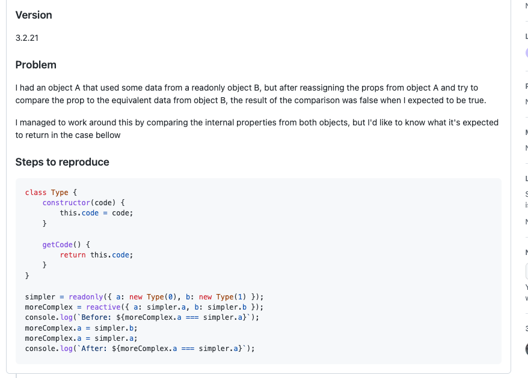
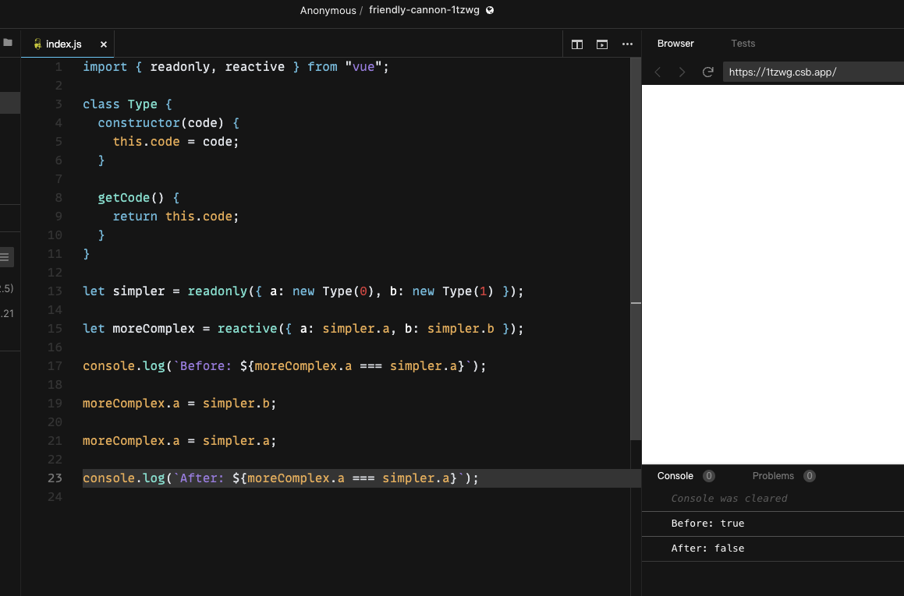
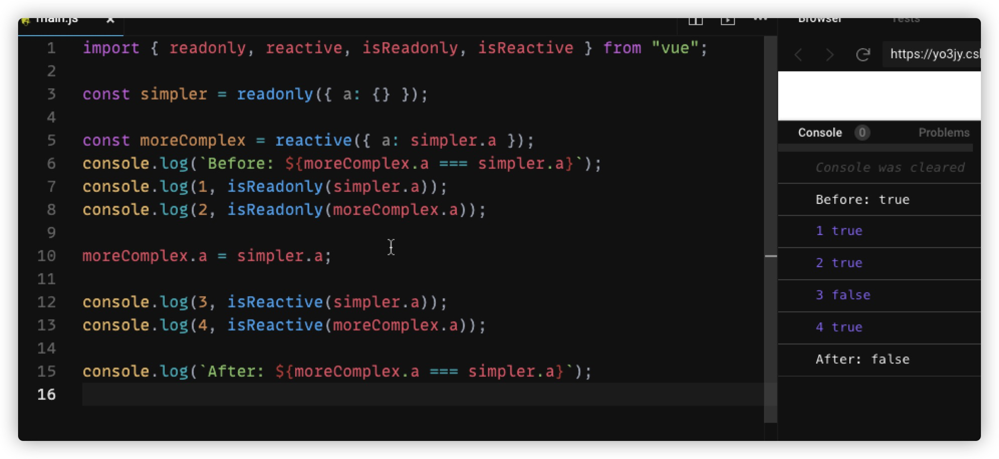
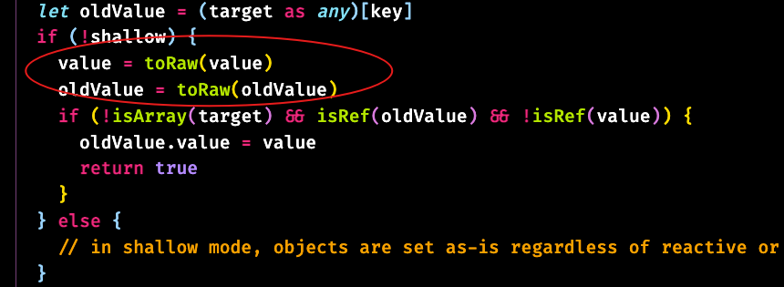
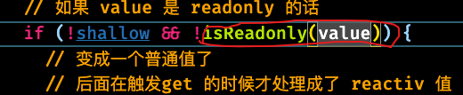
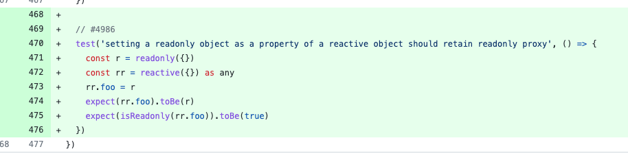
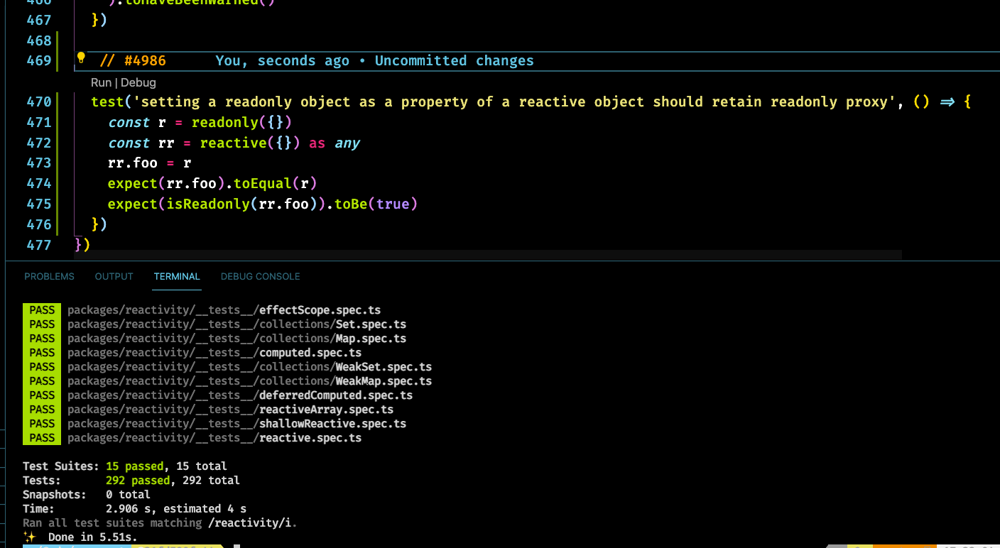
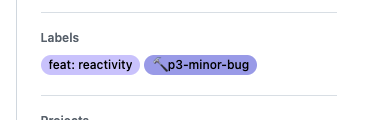

1. 问题描述



- 首先看清楚问题
- 描述版本号 3.2.21
- 用 codesandbox 复现问题,看他逻辑的话 发现只是 reactivity 模块相关的逻辑,所以用一个 js 就可以复现

  

- 进一步改写问题，发现问题依然存在

  

2. 分析问题

- 经过赋值后发现，moreComplex.a 由原来的 readonly 类型 变成了 reactive 类型，所以二者不在相等

```javascript
console.log(`After: ${moreComplex.a === simpler.a}`);
```

- 也就是说，赋值是触发的 set 操作，源码是下面这样的

```javascript
function createSetter(shallow = false) {
  return function set(
    target: object,
    key: string | symbol,
    value: unknown,
    receiver: object
  ): boolean {
    let oldValue = (target as any)[key]
    if (!shallow) {
      value = toRaw(value)
      oldValue = toRaw(oldValue)
      if (!isArray(target) && isRef(oldValue) && !isRef(value)) {
        oldValue.value = value
        return true
      }
    } else {
      // in shallow mode, objects are set as-is regardless of reactive or not
    }

    const result = Reflect.set(target, key, value, receiver)
```
- 代码中 `Reflect.set(target, key, value, receiver)` 的value就是新的值，也就是 `simpler.a`
- 在这里的时候 value 被 toRaw 是做了处理获取到 .value 的值了,所以这里的 value 是发生改变了 就已经不在是之前的 readonly value 了

  

- moreComplex.a = simpler.a 之后，就从 readonly 变成了 reactive 了
- 搞清楚这个问题得先搞起来 reactive 和 readonly 的逻辑
- reactive(value)，这里的 value 如果是一个对象的话，会递归的调用 reactive  都给转换成 reactive
- 但是这里有个点是，如果 value 值本身是 readonly 的话 那么就不会在做处理了
```javascript
// 这一步时候，moreComplex.a 还是readonly 类型
const moreComplex = reactive({ a: simpler.a });

// 赋值
moreComplex.a = simpler.a;
/**
 * 会触发 set 逻辑
 * 而在 set 里面会有一个调用  toRaw 函数的动作
 * 所以这里就会把 simpler.a 转换成 普通的值对象了（从 readonly 转成 普通对象）
 * 到这一步的时候其实，moreComplex.a 已经从 readonly 变成普通对象了
 * 
*/
// 赋值后
```
- 接着执行下一行代码
```javascript
console.log(`After: ${moreComplex.a === simpler.a}`);
/**
 * 接着到这里的对比逻辑
 * 首先触发 get 
 * 而触发 get 的时候 又会触发检测 value 是不是对象  如果是对象的话 他会继续 转换
 * 这里的转换取决于 调用这个 key 的对象是什么类型
 * 我们调用的是 moreComplex.a  key 是 a  ，对象是 moreComplex 
 * 而 moreComplex 是 reactive 对象,所以.a 自然就被转成 reactive 对象了
 * 所以后面的全等对比 自然就是 false 了
 * 
*/
```
3. 解决问题
- 因为 .a 变成了普通的 value，所以才会被转换成 reactive
- 所以只需要在 set 的时候 检测 如果是 readonly 对象的话，那么就别在调用 toRaw 了  那 .a 自然就变不成普通的 value
- 添加判断



- 代码是改完了,但是我们需要检测一下是不是会影响到之前的逻辑
- 这里就是另外一个值得我们学习的点
4. 尤大的提交记录



- 他补了个测试
- 并且这个测试是简化了 issue 里面的情况
- 简化之后的问题就是
- 当给一个 reactive 对象 的 key 赋值为 readonly 的话



- 最后加上测试,跑下所有的测试,发现没有问题,算是这个 bug fix 完成了
- 这里有个细节就是,他会在对应 ut 上给个 issue 的编号
- 还有在处理 issue 的时候的标签管理



- 给了一个 p3 级别的 bug,标记是个小 bug,优先级不是那么高
- 有了优先级的概念,其实就可以把任务做排序了,先优先完成高优先级的issue,这一点对于我们自己工作来讲也是一样的
- 这里对于我们自己也有用,以后我们可以优先看小的 issue,也就是先看 p3-minor 级别的 issue 
