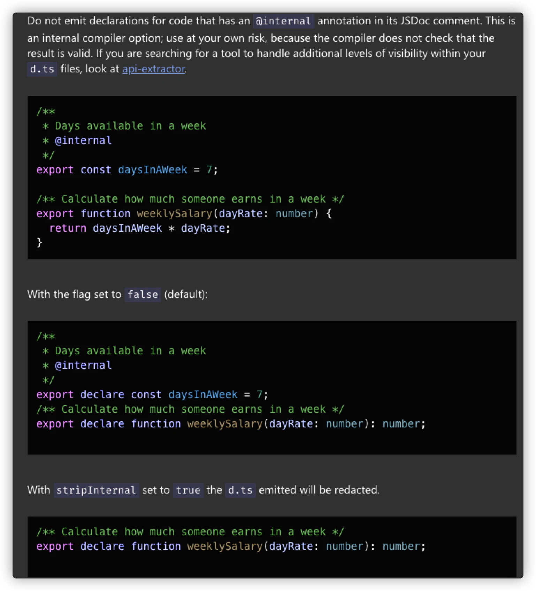

## reactive和ref的类型推导错误 
对应 `issues` 号为: **#1111**

地址: [reactive and ref type infer is Wrong](https://github.com/vuejs/vue-next/issues/1111)

### 问题描述

出现问题版本为: **3.0.0-beta7**

```TypeScript
const state = reactive({
  foo: {
    value: 1,
    label: 'bar',
  },
});

// 推导类型为 `foo: number` 导致 `label` 问题错误
console.log(state.foo.label); // Property 'label' does not exist on type 'number'

```

### 查找原因

#### 1 查看一下 `reactive` 返回的是一个什么类型

```TypeScript
const state = reactive({
  foo: {
    value: 1,
    label: 'bar',
  },
});
// 逐步分析
// 1 T -> {foo: {...}}
export function reactive<T extends object>(target: T): UnwrapNestedRefs<T> // 返回 UnwrapNestedRefs<T>

// 2 T -> {foo: {...}}
type UnwrapNestedRefs<T> = T extends Ref ? T : UnwrapRef<T> // 返回 UnwrapRef<T>

// 3 T -> {foo: {...}}
export type UnwrapRef<T> = T extends ComputedRef<infer V>
  ? UnwrapRefSimple<V>
  : T extends Ref<infer V> ? UnwrapRefSimple<V> : UnwrapRefSimple<T> // 返回 UnwrapRefSimple<T>
  
// 4 T -> {foo: {...}}
type UnwrapRefSimple<T> = T extends
  | Function
  | CollectionTypes
  | BaseTypes
  | Ref
  | RefUnwrapBailTypes[keyof RefUnwrapBailTypes]
  ? T
  : T extends Array<any> ? T : T extends object ? UnwrappedObject<T> : T // 返回 UnwrappedObject<T>
  
// 5 T -> {foo: {...}}
type UnwrappedObject<T> = { [P in keyof T]: UnwrapRef<T[P]> } & SymbolExtract<T> // 进行 UnwrapRef<T[P]>

// 6 T -> {value: 1, label: 'bar'}
export type UnwrapRef<T> = T extends ComputedRef<infer V>
  ? UnwrapRefSimple<V>
  : T extends Ref<infer V> ? UnwrapRefSimple<V> : UnwrapRefSimple<T> // 返回 UnwrapRefSimple<T>
  
// 7 T -> {value: 1, label: 'bar'}
type UnwrapRefSimple<T> = T extends
  | Function
  | CollectionTypes
  | BaseTypes
  | Ref
  | RefUnwrapBailTypes[keyof RefUnwrapBailTypes]
  ? T
  : T extends Array<any> ? T : T extends object ? UnwrappedObject<T> : T // 返回 UnwrappedObject<T>
  
// 8 T -> {value: 1, label: 'bar'}
type UnwrappedObject<T> = { [P in keyof T]: UnwrapRef<T[P]> } & SymbolExtract<T> // 进行 UnwrapRef<T[P]>

// 9 T -> 1, T -> 'bar'
export type UnwrapRef<T> = T extends ComputedRef<infer V>
  ? UnwrapRefSimple<V>
  : T extends Ref<infer V> ? UnwrapRefSimple<V> : UnwrapRefSimple<T> // 返回 UnwrapRefSimple<T>
  
// 10 T -> 1, T -> 'bar'
type UnwrapRefSimple<T> = T extends
  | Function
  | CollectionTypes
  | BaseTypes
  | Ref
  | RefUnwrapBailTypes[keyof RefUnwrapBailTypes]
  ? T
  : T extends Array<any> ? T : T extends object ? UnwrappedObject<T> : T // 返回 T
  
// 11 最终返回

foo: {
  value: number,
  label: string
}
// 这。。。没有问题啊！

// 12 看看 Ref
export interface Ref<T = any> {
  /**
   * @internal
   */
  __v_isRef: true
  value: T
}
// 就是说存在__v_isRef 才是Ref类型，可是 @internal 这是个什么意思？

// 13 查阅 @internal
// 不要发出在其 JSDoc 注释中包含@内部注释的代码的声明。这是一个内部编译器选项; 
// 使用风险自负，因为编译器不检查结果是否有效。如果您正在搜索一个工具来处理 d.ts 文件中其他级别的可见性，请查看 api-extractor。


```




使用这个注释,会在编译后将对应标识去除,也就是会变成这样

```TypeScript
export interface Ref<T = any> {
  value: T
}

// 这个时候我们就知道,只要实现了一个 `value` 属性,就会被认为是 `Ref` 对象, 他把 foo 当初 Ref 了么 ？

// 再从头分析一下解包过程
const state = reactive({
  foo: {
    value: 1,
    label: 'bar',
  },
});
// 逐步分析
// 1 T -> {foo: {...}}
export function reactive<T extends object>(target: T): UnwrapNestedRefs<T> // 返回 UnwrapNestedRefs<T>

// 2 T -> {foo: {...}}
type UnwrapNestedRefs<T> = T extends Ref ? T : UnwrapRef<T> // 返回 UnwrapRef<T>

// 3 T -> {foo: {...}}
export type UnwrapRef<T> = T extends ComputedRef<infer V>
  ? UnwrapRefSimple<V>
  : T extends Ref<infer V> ? UnwrapRefSimple<V> : UnwrapRefSimple<T> // 返回 UnwrapRefSimple<T>
  
// 4 T -> {foo: {...}}
type UnwrapRefSimple<T> = T extends
  | Function
  | CollectionTypes
  | BaseTypes
  | Ref
  | RefUnwrapBailTypes[keyof RefUnwrapBailTypes]
  ? T
  : T extends Array<any> ? T : T extends object ? UnwrappedObject<T> : T // 返回 UnwrappedObject<T>
  
// 5 T -> {foo: {...}}
type UnwrappedObject<T> = { [P in keyof T]: UnwrapRef<T[P]> } & SymbolExtract<T> // 进行 UnwrapRef<T[P]>

// 6 T -> {value: 1, label: 'bar'}
export type UnwrapRef<T> = T extends ComputedRef<infer V>
  ? UnwrapRefSimple<V>
  : T extends Ref<infer V> ? UnwrapRefSimple<V> : UnwrapRefSimple<T> // 返回 UnwrapRefSimple<V> 
  
// foo: UnwrapRef<T[P]> => foo: foo.value => foo: number
  
// 最终返回

foo: {
  value: number,
}

```

### 解决方法

既然是 `__v_isRef` 标识错误, 那么我们初步想到的方案就是将 `@internal` 注释给它去掉，

显然这个方案,是不可行的,这样我们在 **IDE** 中输入 `Ref` 对象的时候,会自动提示 `value/__v_isRef` 提示,显然这个标识使我们框架内部使用, 外部不应该让他知道有这个接口属性

```TypeScript
const RefSymbol = Symbol()

// 我们使用一个 `私有符号` 来代替 `__v_isRef`, 这样既可以达到唯一标识, IDE 也不会提示我们的 symbol 私有符号
export interface Ref<T = any> {
  /**
   * Type differentiator only.
   * We need this to be in public d.ts but don't want it to show up in IDE
   * autocomplete, so we use a private Symbol instead.
   */
  [RefSymbol]: true
  value: T
}
```

### 总结

这个 `issues` 是比较有含量, 我们可以学习到的内容很多

1. [**@internal**](https://github.com/internal) 内部标识符号,我们可以通过他,在编译后,让 IDE 无法获取到,而内部却实现了这个接口

2. 这个是一个巧妙的 `infer` 关键字的使用

3. **Symbol()** 私有符号在 `TS` 中的运用

4. 组合大于继承, 在 `vue3` 中我们可以发现 `尤大` 特别喜欢使用内部创建对象返回, 而不是创建类,进行封装, `createApp` 返回的 `app` 实例对象,就是一个对象, 创建代理对象,都是通过 `createReactiveObject` 返回对象, 今天的 `issues` 中的 `Ref`